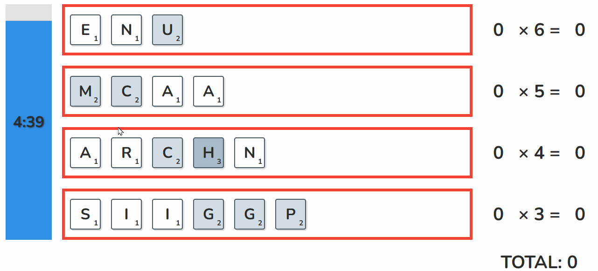

# Lexo

A fun, daily word puzzle game where you rearrange letter tiles to form high-scoring words.

[](https://react.dev/)
[](https://www.typescriptlang.org/)
[](https://vite.dev/)
[](https://vitest.dev/)
[](https://www.python.org/)
[](https://fastapi.tiangolo.com/)
[](https://github.com/astral-sh/ruff)
[](https://sqlite.org/)
[](https://codeassist.google/)




## Features

-   **Unique Daily Puzzles**: A new challenge awaits you every day.
-   **Drag & Drop Interface**: Intuitively rearrange letter tiles to form words.
-   **Timed Gameplay**: Race against the clock to find the best possible words.
-   **Shareable Results**: Easily copy your score to your clipboard to share with friends.
-   **Game Archives**: Revisit and play puzzles from previous dates.
-   **Light & Dark Mode**: Automatically adapts to your system preference, with a manual override.

## Tech Stack

-   **Frontend**:
    -   **Framework**: React 19 with Vite
    -   **Language**: TypeScript
    -   **Drag & Drop**: `dnd-kit`
    -   **Styling**: Plain CSS with CSS Variables
    -   **Testing**: Vitest & React Testing Library
-   **Backend**:
    -   **Framework**: FastAPI
    -   **Language**: Python 3.13+
    -   **Database/ORM**: SQLModel
    -   **Server**: Uvicorn

## Getting Started

Follow these instructions to get a copy of the project up and running on your local machine for development and testing purposes.

### Prerequisites

-   Node.js (v20 or later recommended)
-   pnpm
-   Python (v3.13 or later)

### Installation & Setup

1.  **Clone the repository:**

    ```bash
    git clone https://github.com/madjaqk/lexo.git
    cd lexo
    ```

2.  **Set up the Python backend:**

    ```bash
    # Navigate to the server directory
    cd server
    uv sync --all-groups
    ```

3.  **Set up the React frontend:**

    ```bash
    # Navigate to the client directory from the root
    cd ../client

    # Install dependencies
    pnpm install
    ```

### Running the Application

You will need two separate terminal windows to run both the backend and frontend servers.

1.  **Build the front-end client:**
    -   In another terminal at the `client` directory:
    ```bash
    pnpm watch
    ```
    - This will build the front-end files to `client/build/dist`, and rebuild on code change.
2.  **Start the back-end server:**
    -   In a terminal at the `server` directory:
    ```bash
    # Generate a daily puzzle
    uv run python -m app.scripts.generate_puzzles
    # See `uv run python -m app.scripts.generate_puzzles --help` for instructions on generating puzzles for past or future dates

    uv run fastapi dev app/main.py
    ```
    -   The API will be running at `http://127.0.0.1:8000`, including serving the front-end files.

## License

This project is licensed under the MIT License - see the LICENSE file for details.

## Reflections (AKA Jack's Blog Post)

I've been a professional developer for almost 10 years now, and while I've found the newest wave of LLMs and AI impressive, I didn't have much hands-on experience using them for code generation.  I tried to do this project in the vibe coding style, giving instructions to the AI but not touching the code myself, with reasonable success.  I used both GitHub Copilot and (when I had exhausted their free tier) Gemini Code Assist, with Copilot feeling overall more polished but both being remarkably capable compared to what I would have thought possible just a few years ago.

Most of the code in this project was written by AI, especially the more meat-and-potatoes code, the pieces that basically any project would have—React UI components, SQLModel tables and FastAPI endpoints that read from them, and the like.  I shouldn't undersell it, though; it was astonishing to watch Gemini go from a command like "Please create a modal to display the game's instructions" to a completely functional component, complete with integration into the rest of the app (and decently written instructions, probably better than I would have managed).  I manually got involved in cases where I had some very specific lay-out or interaction in mind that I had trouble explaining in words (or I didn't know exactly what I wanted and needed to experiment), when the change was small enough that I felt confident that I could execute in less time than it would take to explain to the AI what I wanted, or to debug.

Debugging AI-generated code is somewhat of a mixed bag.  Even before I started on this project, I've had some success debugging issues just by explaining what I was trying to do in the Gemini or Claude web chat interface and copying in error messages.  Perhaps unsurprisingly, it's most useful when dealing with common issues or easy mistakes to make, cases where there's definitely a high-quality StackOverflow answer out there somewhere.  As the problems become more esoteric, the AI becomes less reliable, but you can never count it out entirely—I've seen it stumble into the correct solution on its fourth or fifth try.  My biggest complaint here is its false confidence: It will always describe the most recent change as definitely fixing the problem, even after multiple successive failures, and (particularly annoying to me) will help "clean up" files by deleting all of my debugging `console.log`s before I've had a chance to review.

The AI tools definitely increased my productivity, helping me write a functional (and good-looking) React app when I had done little more than tutorials with the framework, but they also shifted the nature of the work—writing code myself took a backseat to orchestrating and reviewing GPT and Gemini's work.  It's a different type of problem-solving to which I'm still adapting.


|  |
| :---: |
| _After several back-and-forth messages arguing about an architectural decision, Gemini's suggested "Prompts to try" wanted me to concede that it was correct._ |
